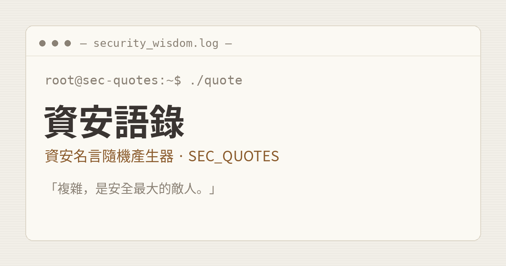
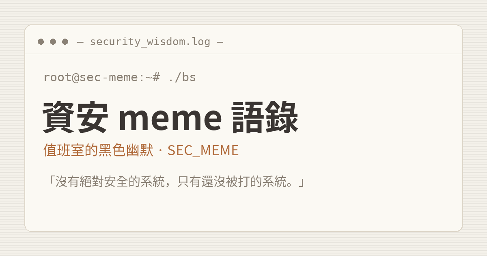

# 資安語錄產生器 · infosec-quotes

駭客終端機風（暖灰紙張配色）的資安語錄隨機產生器，一個 repo、兩個網站。純靜態單頁，無建置、無相依。

**線上版**

- 首頁：https://stwater20.github.io/infosec-quotes/
- 正經版：https://stwater20.github.io/infosec-quotes/serious.html
- meme 語錄版：https://stwater20.github.io/infosec-quotes/meme.html

| 正經版 `serious.html` | meme 語錄版 `meme.html` |
|:---:|:---:|
|  |  |
| 業界真實名言與通用箴言 | 值班室的黑色幽默，笑的是處境不是人，純屬娛樂 |

首頁 `index.html` 提供兩站入口。

**每站功能**：隨機語錄、每日一句、一鍵複製、分享、語錄圖卡下載（PNG）、三種終端機主題切換（記憶偏好）。

## 想貢獻語錄？

語錄全放在各站的 quotes 檔（[`serious.quotes.json`](./serious.quotes.json)、[`meme.quotes.json`](./meme.quotes.json)），**不用碰任何程式碼**。照格式加一筆、發 PR 就好，合併幾乎零衝突：

```json
{ "t": "語錄內容", "a": "出處或作者", "tag": "分類標籤" }
```

| 欄位 | 說明 |
|------|------|
| `t`  | 語錄本體（必填） |
| `a`  | 作者 / 出處（必填；正經版求真實，meme 版可虛構搞笑） |
| `tag`| 單一分類標籤（必填） |

**共同原則**：不接受攻擊、影射、貶低任何特定個人、公司或群體的內容。meme 版走自嘲與共鳴路線。送 PR 前用 `python3 -m json.tool <檔案>` 確認 JSON 沒壞。

## 本機預覽

瀏覽器會擋 `file://` 讀取 quotes 檔，本機請用簡易伺服器預覽：

```bash
python3 -m http.server 8000
# 開 http://localhost:8000/
```

## 相關

更多資安工具：https://sectools.tw/tools

## 授權

MIT
